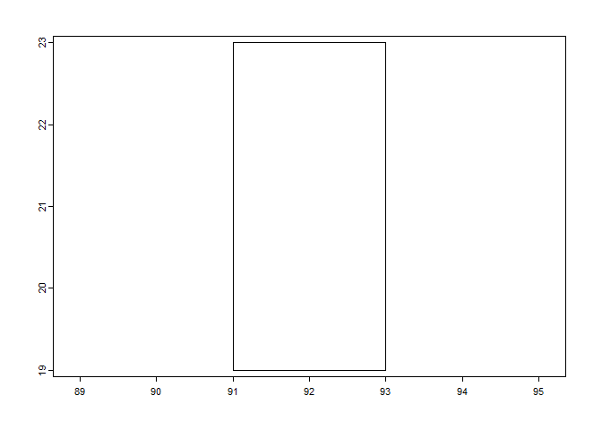
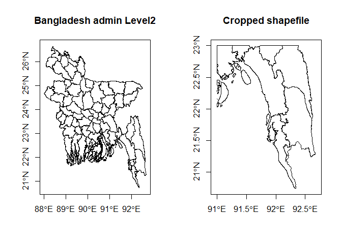
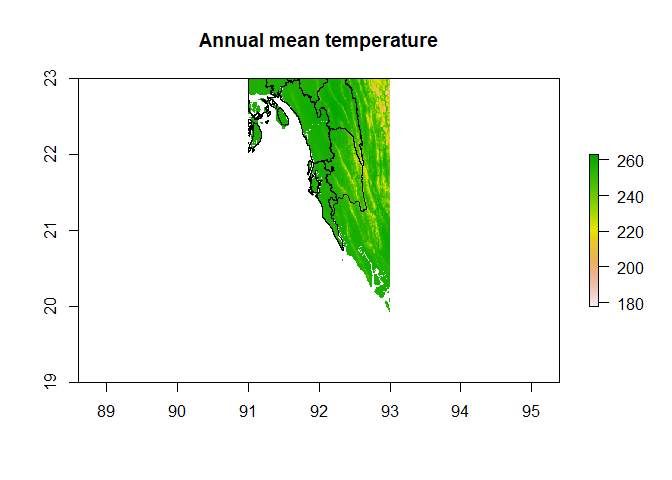
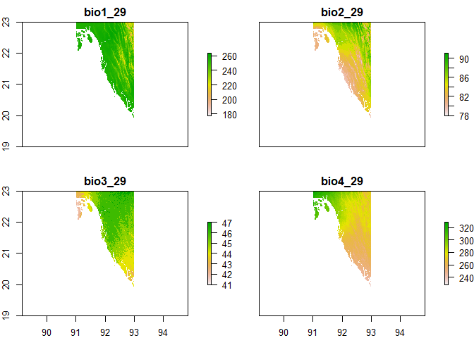
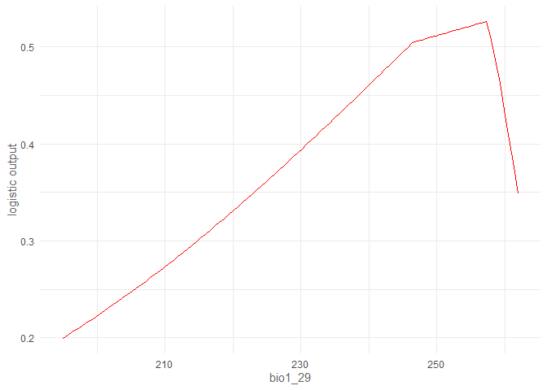
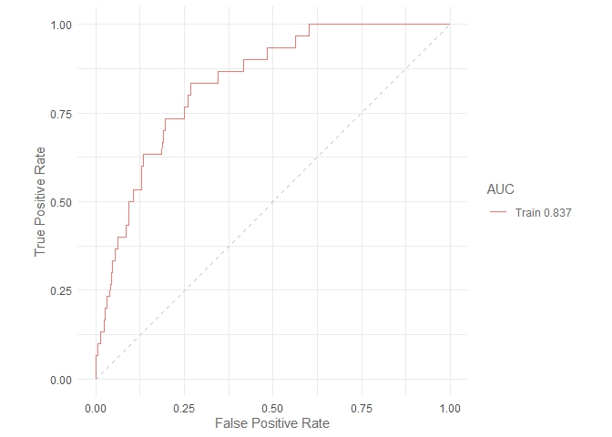
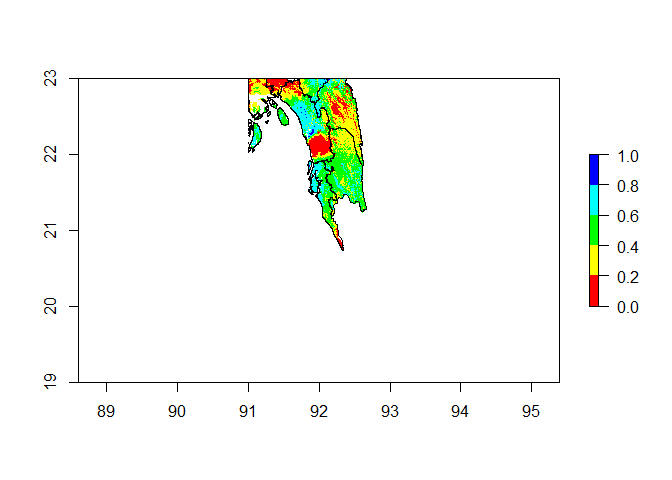

# Maxent demo model run in R

## SETUP R PROJECT

-   Start fresh

When we run a R project over and over again. Sometimes it is better to
start from beginning. Clearing R memory and session variables

``` r
gc()            # clear memory
```

    ##          used (Mb) gc trigger (Mb) max used (Mb)
    ## Ncells 466832 25.0    1011704 54.1   644202 34.5
    ## Vcells 845054  6.5    8388608 64.0  1637088 12.5

``` r
rm(list=ls())   # clear R session
```

-   Set work directory

This is an important step because we want to make sure our data and
outputs are saved clearly inside our project folder. So, we first make
sure that we are working inside our project directory. To check the
current project directory use getwd() function. And to change the
current working directory to a new one, use the setwd() function

``` r
getwd()
```

    ## [1] "D:/github/sdm"

``` r
# setwd("D:/github/sdm") 
```

Now we create two separate folder inside our project directory
i.e. inside the “D:/github/sdm” folder to save data and results

``` r
dir.create("./data")
```

    ## Warning in dir.create("./data"): '.\data' already exists

``` r
dir.create("./result")
```

    ## Warning in dir.create("./result"): '.\result' already exists

## STEP 1: Install required libraries

For our project first we need to install few R packages. Make sure to
run them for first time. Note: the dismo package is for running the
maxent. The maxent function requires rJava package. So, in your
desktop/laptop Java should be installed, if not you will get error.

``` r
#install.packages("raster",dependencies = T)
#install.packages("dismo",dependencies = T)
#install.packages("SDMtune",dependencies = T)
```

Now load the packages

``` r
library(raster)
```

    ## Loading required package: sp

``` r
library(SDMtune)
```

    ## 
    ##    _____  ____   __  ___ __
    ##   / ___/ / __ \ /  |/  // /_ __  __ ____   ___
    ##   \__ \ / / / // /|_/ // __// / / // __ \ / _ \
    ##  ___/ // /_/ // /  / // /_ / /_/ // / / //  __/
    ## /____//_____//_/  /_/ \__/ \__,_//_/ /_/ \___/  version 1.1.5
    ## 
    ## To cite this package in publications type: citation("SDMtune").

``` r
library(dismo)
library(terra)
```

    ## terra 1.6.7

## Step 2 : Prepare data for model

There are different ways of implementing a SDM. The following workflow
is a practical way that I use. I do not state that this is the best way
of most efficient way. However, I find that this works good for my
projects.

The most important and perhaps the hardest of all in making a SDM to
decide study area, input predictors and then prepare for modelling. Here
we, first decide an study area extent bounded by bounding box
91,93,19,23 (min longitude, max longitude, min latitude, max latitude)
Then we download a level2 administrative division shapefile from GADM
website

## 2.1 GET BD SHAPEFILE and WORLCLIM data

``` r
ext = c(91,93,19,23)  # c(xmin,xmax,ymin,ymax)
# -30.506739, -30.530748, 143.158580, 143.128823
# aus_ext = c(-30.506739, -30.530748, 143.158580, 143.128823)
plot(ext(ext))
```



``` r
#help(getData,raster)
bd  = getData('GADM',country='Bangladesh',level=2,path = "./data",download = F)
```

    ## Warning in getData("GADM", country = "Bangladesh", level = 2, path = "./data", : getData will be removed in a future version of raster
    ## . Please use the geodata package instead

``` r
# aus=getData('GADM',country='Australia',level=2,path = "./data",download = T)
# plot(aus,axes=T)
bd_main = bd # saving in a new variable to use later
```

Crop the country shape file to study area extent

``` r
bd  = crop(bd,extent(ext))
```

Make plot to visualize the data layers

``` r
par(mfrow=c(1,2))
plot(bd_main,axes=T, main="Bangladesh admin Level2")
plot(bd,axes=T, main="Cropped shapefile")
```



``` r
dev.off() # close the plot
```

    ## null device 
    ##           1

## 2.2 Raster/Image data: GET WORLD CLIM DATA

The worldclim website provides the documentation of the bioclimatic
variables and other important details about the data. There are other
variables for example elevation, windspeed etc. Note several future
climatic projection datasets are also avaialbe on the website. I
recommend to check the website and read about the data
browseURL(“<https://www.worldclim.org/data/bioclim.html>”)

Here we, download the 19 bioclimatic variables. We coose the resolution
“0.5” degress which is roughly 1km2 grid size This is the spatial
resolution in case of images. Because this is a big image we can’t
download the global image, rather we need to give a longitude latidue
coordinates as getData() function argument. Then an data will be
downloaded sorrunding the coordinates (this is not the best description)
but the function documentation is good enouhg for understanding. So,
please read help(getData, raster) package documentation We also, provide
a directory where to save the data as the path argument “path” The
download=F argument specifies that don’t download, if we alreay
previously download

``` r
#help(getData,raster)
bio19 = getData(
  name='worldclim',
  var='bio',
  res=0.5,
  lon=90, 
  lat=22,
  path = "./data",
  download=F
  )
```

    ## Warning in getData(name = "worldclim", var = "bio", res = 0.5, lon = 90, : getData will be removed in a future version of raster
    ## . Please use the geodata package instead

### Plotting raster images

We can check the images using default plot function.

``` r
# the number of layers
nlayers(bio19)
```

    ## [1] 19

``` r
bio19 = crop(bio19,extent(ext))  # crop the data using the extent

# HOW TO PLOT RASTER AND SHAPEFILE
plot(bio19[[1]],main="Annual mean temperature")
plot(bd,add=T)
```



``` r
# first four layers
plot(bio19[[1:4]])
```



``` r
# saving the results
pdf("./result/bio1-4.pdf",width = 6,height = 4)
plot(bio19[[1:4]])
dev.off()
```

    ## png 
    ##   2

To save the images in computer memory.

``` r
# SAVING AND RE-READING
# writeRaster(bio19,filename = "./data/bio19_bd.grd",overwrite=T)
# bio19 = stack("./data/bio19_bd.grd")
```

## STEP 4: Prepare data for Maxent and run Maxent

### GET RANDOM POINTS

For maxent SDM We need occurrenct points which is sometimes called
observed occurrences Then we also need where the species are not
present, also called absense Logistic model, \# Presense = 1, Absense =
0 But Maxent is popular because we do not necessarily need or have
Absense data We can randomly genereate these points and using Maxent
model try to approximate the species distribution, please refer to
Phillips, S. J. (2005). A brief tutorial on Maxent. AT&T Research,
190(4), 231-259.

### Presence points

``` r
#occ = dismo::randomPoints(n=30,bio19[[1]])
# If you have your species occurrence points in a csv file where first two
# columns are "longitude" and "latitude" (order is important), then you can
# read them 
occ = read.csv("./data/occ.csv")
```

We randomly sample 1000 points across our study area to represent
background points. Which represents locations where the species were
absense.

``` r
# Absense points
bg = dismo::randomPoints(n=1000,bio19[[1]])
```

## Using SDMtune package

Model development using SDMtune package involves creating an SWD object.
The package documentation is truely details enough and a great resource.
I recommend you to try it first help(train,“SDMtune”).

``` r
# Prepare data SWD object which actually only requires for SDMtune model
# If we want to use other package we do not need this format. But, SDMtune
# package is very useful, later we will discover.
data <- SDMtune::prepareSWD(
  species = "Pathenium hys", 
  p = occ, 
  a = bg,
  env = bio19, 
  )
```

    ## Extracting predictor information for presence locations...

    ## Extracting predictor information for absence/background locations...

The SWD object arranges required data for model training. We can check
the SWD object that we created in this case “data”. Using @ (at) sign we
can access the data stored in this object.

``` r
# check the data object, what is inside
data@species
```

    ## [1] "Pathenium hys"

``` r
data@data[1:10,1:3]
```

    ##    bio1_29 bio2_29 bio3_29
    ## 1      259      86      46
    ## 2      243      88      46
    ## 3      257      85      45
    ## 4      257      83      46
    ## 5      254      86      45
    ## 6      247      81      45
    ## 7      250      83      45
    ## 8      249      85      46
    ## 9      258      86      46
    ## 10     257      84      43

``` r
data@pa[1:6]
```

    ## [1] 1 1 1 1 1 1

``` r
data@coords[1:6,]
```

    ##          X        Y
    ## 1 91.93750 22.43750
    ## 2 92.87917 22.72083
    ## 3 91.65417 22.66250
    ## 4 92.15417 21.84583
    ## 5 92.72083 21.77917
    ## 6 92.37917 21.45417

# TRAIN A DEFAULT MAXENT MODEL

the train() function of the SDMtune package is used to train a model The
type of model to train is defined by the method argument. In our case it
is “Maxent”. Read the function documentation help(train, SDMtune)

For a maxent model we can specify some more argument, for example which
feature classes we want to use. The argument for that is “fc”. The below
code

We only specify “lqh” which stands for linear, quardatic and hinge
feature classes. The regularization value in the original maxent
implementation is 0.5. But increase of SDMtune is 1, so we can specify
which one to use If we want we can tune this value i.e. find a value
based on some algorithm search

``` r
mx1 = train(
  method = "Maxent",  # the name of the model
  fc="lqh",           # feature classes: linear, quadratic, hinge
  reg=0.5,            # regularization parameters
  verbose = T,        # show message during training
  data = data,        # the data variable
  iter = 1000         # number of iterations the logarithm will run
  )    
```

    ## Loading required namespace: rJava

### Model results

SDMtune has several functions to show the model results First we plot
the response curves, for the first predictor variable we can do that for
multiple variables also

``` r
# plot the response curve
plotResponse(mx1, var = c("bio1_29"), type = "logistic")
```



``` r
# Then we plot the ROC curve for our model which shows the traing AUC
auc(mx1)        # just to get the model AUC
```

    ## [1] 0.8371167

``` r
plotROC(mx1)    # to plot the AUC curve
```



### APPLY MODEL PREDICTION

Finally we predict our train model to the data to get probability of
occurrence in each pixel/gird in our study area

``` r
map = predict(mx1, data=bio19, type="logistic")
```

The output is a raster layer, which is a image data class for raster
package. We can plot the map using plotPred() function. We could use the
default plot() function or even ggplot2 package. But for now we will
just use the plotPred function.

# plot the results

``` r
dev.off() # clear the plotting window at first
```

    ## null device 
    ##           1

``` r
plotPred(map, 
 lt = "Habitat\nsuitability",
 colorramp = c("#2c7bb6", "#abd9e9", "#ffffbf", "#fdae61", "#d7191c")
)
```

Here is another way of plotting the map crop the prediction to our study
area

``` r
bd_pred = mask(map,bd)
plot(
  bd_pred,
  breaks=seq(0,1,0.2),
  col= rainbow(length(seq(0,1,0.2)))
 )
plot(bd,add=T) # overlay the shapefile on top of it
```



### Furthur reading

Finally the SDMtune package have much more functionality for example
rather than default values or set of values for featureclasss (FC) and
regularization values (RM) we can test for different values. We can use
grid search or random search strategies. Please read the package
vignettes.

``` r
# Check SDM PACKAGE HELP
browseURL(url = "https://cran.r-project.org/web/packages/SDMtune/vignettes/basic-use.html")
```
